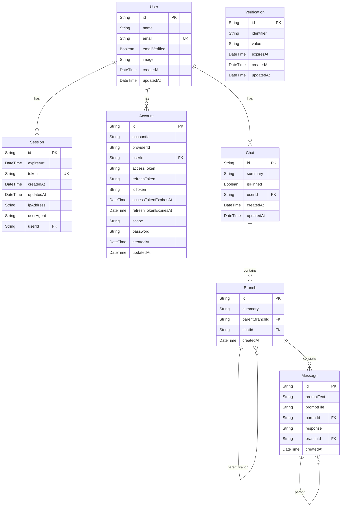

# データベース設計ドキュメント

このドキュメントでは、Eda.aiアプリケーションのデータベース設計について説明します。

## ER図

以下はデータベースのエンティティ関係図です。



## テーブル詳細

### 1. User（ユーザー）

**目的**: アプリケーションのユーザーを管理します。

**主なフィールド**:

- `id` (String, PK): ユーザーの一意識別子
- `name` (String): ユーザー名
- `email` (String, UK): メールアドレス（一意）
- `emailVerified` (Boolean): メール認証済みフラグ
- `image` (String?): プロフィール画像URL（オプション）
- `createdAt` / `updatedAt` (DateTime): 作成日時・更新日時

**リレーション**:

- `accounts`: 1ユーザーは複数の認証アカウントを持てる（1対多）
- `sessions`: 1ユーザーは複数のセッションを持てる（1対多）
- `chats`: 1ユーザーは複数のチャットを作成できる（1対多）

---

### 2. Session（セッション）

**目的**: ユーザーのログインセッションを管理します（Better Auth）。

**主なフィールド**:

- `id` (String, PK): セッションの一意識別子
- `token` (String, UK): セッショントークン（一意）
- `expiresAt` (DateTime): セッション有効期限
- `ipAddress` (String?): クライアントIPアドレス
- `userAgent` (String?): ユーザーエージェント情報
- `userId` (String, FK): 所属ユーザーID

**リレーション**:

- `user`: セッションは1人のユーザーに所属（多対1）
- ユーザー削除時、関連するセッションもカスケード削除

---

### 3. Account（アカウント）

**目的**: 外部認証プロバイダー（OAuth等）のアカウント情報を管理します（Better Auth）。

**主なフィールド**:

- `id` (String, PK): アカウントの一意識別子
- `accountId` (String): プロバイダー側のアカウントID
- `providerId` (String): 認証プロバイダー識別子（例: "google", "github"）
- `accessToken` / `refreshToken` / `idToken` (String?): OAuthトークン類
- `accessTokenExpiresAt` / `refreshTokenExpiresAt` (DateTime?): トークン有効期限
- `scope` (String?): OAuthスコープ
- `password` (String?): パスワード（クレデンシャル認証用）
- `userId` (String, FK): 所属ユーザーID

**リレーション**:

- `user`: アカウントは1人のユーザーに所属（多対1）
- ユーザー削除時、関連するアカウントもカスケード削除

---

### 4. Verification（検証）

**目的**: メール認証やパスワードリセットなどの検証コードを管理します（Better Auth）。

**主なフィールド**:

- `id` (String, PK): 検証レコードの一意識別子
- `identifier` (String): 検証対象の識別子（例: メールアドレス）
- `value` (String): 検証コードやトークン
- `expiresAt` (DateTime): 検証コードの有効期限

**リレーション**:

- 独立したテーブル。他のテーブルとの外部キー関係はありません。

---

### 5. Chat（チャット）

**目的**: チャットセッション（会話のコンテナ）を管理します。

**主なフィールド**:

- `id` (String, PK, UUID): チャットの一意識別子
- `summary` (String): チャットの要約・タイトル
- `isPinned` (Boolean): ピン留めフラグ（デフォルト: false）
- `userId` (String, FK): 作成者ユーザーID
- `createdAt` / `updatedAt` (DateTime): 作成日時・更新日時

**リレーション**:

- `user`: チャットは1人のユーザーに所属（多対1）
- `branches`: 1チャットは複数のブランチを持てる（1対多）
- ユーザー削除時、関連するチャットもカスケード削除

---

### 6. Branch（ブランチ）

**目的**: チャット内の会話分岐（Gitのブランチのような木構造）を管理します。

**主なフィールド**:

- `id` (String, PK, UUID): ブランチの一意識別子
- `summary` (String): ブランチの要約
- `parentBranchId` (String?, FK): 親ブランチID（自己参照、オプション）
- `chatId` (String, FK): 所属チャットID
- `createdAt` (DateTime): 作成日時

**リレーション**:

- `chat`: ブランチは1つのチャットに所属（多対1）
- `parentBranch`: 親ブランチ（自己参照、多対1）
- `childBranches`: 子ブランチ一覧（自己参照、1対多）
- `messages`: 1ブランチは複数のメッセージを持てる（1対多）
- チャット削除時、関連するブランチもカスケード削除

**特徴**: 自己参照リレーションにより、ブランチの分岐（ツリー構造）を表現できます。

---

### 7. Message（メッセージ）

**目的**: ブランチ内の個別メッセージ（ユーザー入力とAI応答）を管理します。

**主なフィールド**:

- `id` (String, PK, UUID): メッセージの一意識別子
- `promptText` (String): ユーザーの入力テキスト
- `promptFile` (String?): 添付ファイルのパス（オプション）
- `parentId` (String?, FK): 親メッセージID（自己参照、オプション）
- `response` (String): AIからの応答テキスト
- `branchId` (String, FK): 所属ブランチID
- `createdAt` (DateTime): 作成日時

**リレーション**:

- `branch`: メッセージは1つのブランチに所属（多対1）
- `parent`: 親メッセージ（自己参照、多対1）
- `children`: 子メッセージ一覧（自己参照、1対多）
- ブランチ削除時、関連するメッセージもカスケード削除

**特徴**: 自己参照リレーションにより、メッセージの連鎖（スレッド構造）を表現できます。

---

## 自己参照リレーション（再帰構造）の詳細

本データベース設計の特徴的な部分は、**Branch**と**Message**の2つのモデルが自己参照（自己結合）リレーションを持っている点です。

### Branchの自己参照：ブランチ分岐構造

Branchモデルは、Gitのブランチのような**木構造（ツリー構造）**を表現できます。

```
Chat
├── Branch A (main)
│   ├── Message 1
│   ├── Message 2
│   └── Message 3
│
└── Branch B (feature) ← parentBranchId = Branch A.id
    ├── Message 4 (分岐点)
    ├── Message 5
    └── Message 6

Branch C (hotfix) ← parentBranchId = Branch A.id
    ├── Message 7 (分岐点)
    └── Message 8
```

**仕組み**:

- `parentBranchId` フィールドが同じテーブルの別レコードの `id` を参照
- `parentBranch` リレーションで親ブランチを取得
- `childBranches` リレーションで子ブランチ一覧を取得
- これにより、ブランチの分岐履歴を追跡可能

**ユースケース**:

- 同じチャット内で異なる会話の方向性を試す
- 特定のメッセージから別の話題に分岐
- 会話のバージョン管理

---

### Messageの自己参照：メッセージ連鎖構造

Messageモデルは、**メッセージの連鎖（スレッド構造）**を表現できます。

```
Branch: main
├── Message 1 (parentId: null)
│   └── Message 2 (parentId: Message 1.id)
│       └── Message 3 (parentId: Message 2.id)
│           └── Message 4 (parentId: Message 3.id)
│               └── Message 5 (parentId: Message 4.id)
```

**仕組み**:

- `parentId` フィールドが同じテーブルの別レコードの `id` を参照
- `parent` リレーションで親メッセージ（前のメッセージ）を取得
- `children` リレーションで子メッセージ（次のメッセージ）一覧を取得
- これにより、メッセージの時系列順序と応答関係を追跡可能

**ユースケース**:

- 会話の流れを正確に記録
- 特定のメッセージに対する応答関係を追跡
- ブランチ分岐時の分岐点メッセージを特定

---

## データベース設計の特徴まとめ

| 特徴               | 説明                                                          |
| ------------------ | ------------------------------------------------------------- |
| **認証基盤**       | Better Authを使用。User, Session, Account, Verificationで構成 |
| **チャット構造**   | Chat → Branch → Message の3階層構造                           |
| **ブランチ分岐**   | Branchの自己参照により、Gitのようなブランチ管理が可能         |
| **メッセージ連鎖** | Messageの自己参照により、会話の流れを正確に記録               |
| **カスケード削除** | 親レコード削除時、子レコードも自動削除（データ整合性）        |
| **UUID採用**       | Chat, Branch, MessageのIDにはUUIDを使用（分散環境での一意性） |

---

## 関連ファイル

- Prismaスキーマ: `prisma/schema.prisma`
- Prismaクライアント: `src/lib/prisma.ts`
